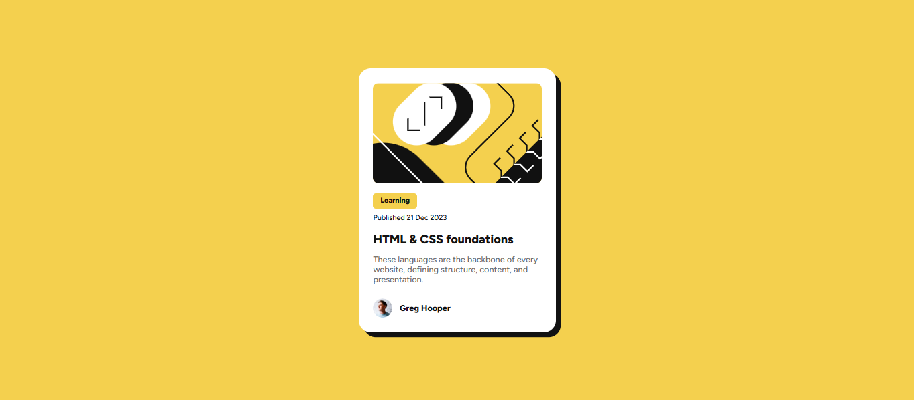

# Frontend Mentor - Blog preview card solution

This is a solution to the [Blog preview card challenge on Frontend Mentor](https://www.frontendmentor.io/challenges/blog-preview-card-ckPaj01IcS). Frontend Mentor challenges help you improve your coding skills by building realistic projects.

## Table of contents

- [Overview](#overview)
  - [The challenge](#the-challenge)
  - [Screenshot](#screenshot)
  - [Links](#links)
- [My process](#my-process)
  - [Built with](#built-with)
  - [What I learned](#what-i-learned)
- [Author](#author)

## Overview

### The challenge

Users should be able to:

- See hover and focus states for all interactive elements on the page.

### Screenshot



### Links

- Solution URL: [https://github.com/dehzanatta03/blog-preview-card](https://github.com/dehzanatta03/blog-preview-card)
- Live Site URL: [https://blog-preview-card-khaki-five.vercel.app/](https://blog-preview-card-khaki-five.vercel.app/)]

## My process

### Built with

- Semantic HTML5 markup
- CSS custom properties (`:root` variables)
- Flexbox
- Responsive Web Design (Media Queries)
- Custom local fonts using `@font-face`

### What I learned

Building this project was an excellent opportunity to solidify core frontend foundations. I focused heavily on writing semantic HTML and maintaining a clean, scalable CSS architecture.

Key technical highlights include:

- **Semantic HTML:** Structuring the card using tags like `<article>` and `<footer>` to ensure the content is self-contained, improving both accessibility and SEO.
- **CSS Architecture:** Utilizing `:root` variables to store design tokens (such as colors, fonts, and weights), which keeps the stylesheet organized and maintainable.
- **Flexbox Alignment:** Applying `margin-top: auto` and `margin-bottom: auto` inside a flex container. This was a highly effective solution to push the author footer to the bottom of the card, guaranteeing consistent alignment regardless of the text content's length.
- **Typography Control:** Successfully loading and applying the _Figtree_ variable font locally and adjusting `line-height` and `letter-spacing` to achieve a pixel-perfect match with the original design.

```css
/* Example of the flexbox trick used to align the footer */
.card-text {
  margin-bottom: auto;
}

.footer {
  display: flex;
  align-items: center;
  margin-top: auto;
}
```


Author

Developer - Debora Zanatta
GitHub - @dehzanatta03
Frontend Mentor - @dehzanatta03
